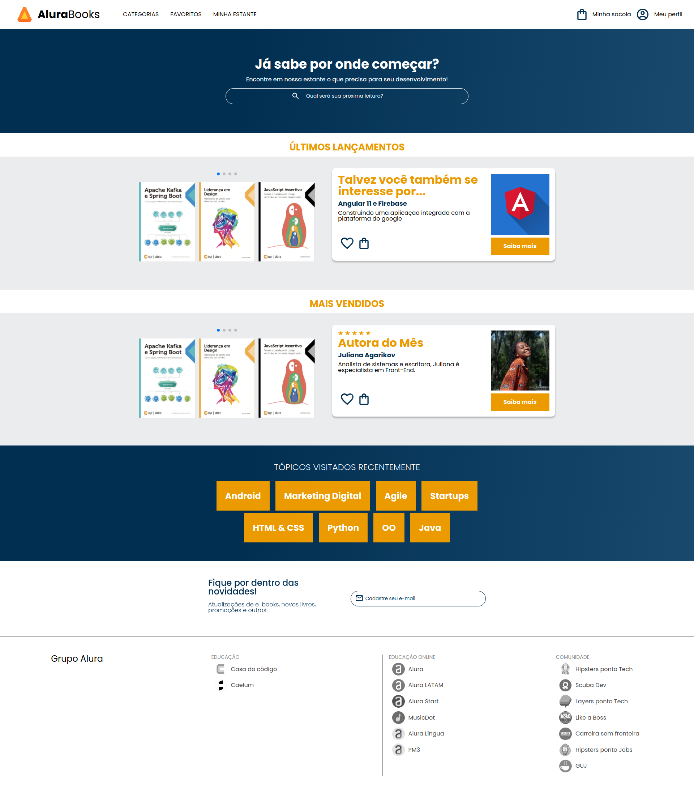

# Alura Books

# Sobre o projeto

O projeto é um site de livros desenvolvido com HTML, CSS e JS ao final do curso de responsividade com mobile-first da <a href="https://www.alura.com.br/">Alura</a>. Durante o desenvolvimento foi utilizado o conceito de mobile-first que é a criação de projetos web primeiro em dispositivos móveis, para depois fazer adaptações para o desktop e outras plataformas. O site possui diversas funcionalidades como menu hambúrguer, dropdown, slider e foram utilizados os principais recursos do CSS.  

Link do site: https://tm-alura-books.netlify.app/

##  👩‍💻 Demonstração

## 🚀 Tecnologias Usadas

- ✔️ [HTML](https://developer.mozilla.org/pt-BR/docs/Web/HTML)

- ✔️ [CSS](https://developer.mozilla.org/pt-BR/docs/Web/CSS)

- ✔️ [JavaScript](https://developer.mozilla.org/pt-BR/docs/Web/JavaScript)

